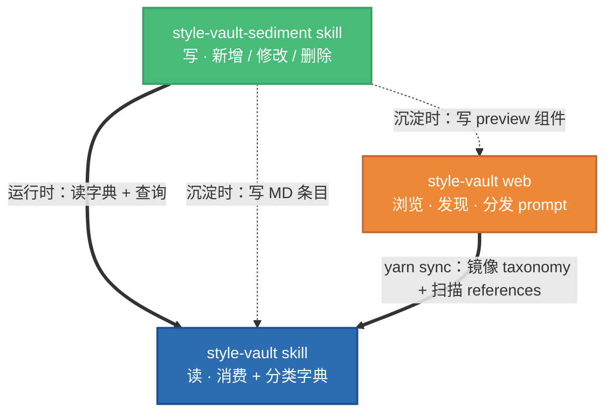

# style-vault skill

**个人风格资产库 · 读侧** · 消费风格资产、查询分类字典、生成对齐风格的前端代码。

这是 style-vault 三件套中的**读 skill**，**所有使用者都必装**——它和网站是绑定的：消费者从网站复制 prompt 后需要本 skill 解析资产并产出代码。

写入（新增 / 修改 / 删除风格）请用兄弟 skill [`style-vault-sediment`](../style-vault-sediment/)（仅创作者需要）。

---

## 三件套架构

style-vault 系统由三个相互协作的项目组成：



| 项目 | 类型 | 作用 |
|---|---|---|
| **style-vault skill**（本仓） | Claude Code skill | AI 消费风格 + 查询分类字典 |
| **style-vault-sediment skill** | Claude Code skill | AI 沉淀 / 修改 / 删除风格 |
| **style-vault web** | React + FastAPI 仓库 | 浏览网站 + prompt 卡片分发 |

skill 装到你 Claude Code 的 skills 目录下（两个 skill 互为兄弟目录）。具体路径取决于你的配置，下文用 `<skill-dir>/style-vault/` 等表示。

---

## 本 skill 做什么

**消费模式**：用户在 web 上找到喜欢的风格 → 复制 prompt（含资产 id）→ 粘贴到本地 AI → AI 装了这个 skill 就能读 MD + 合并 tokens + 产出代码。

**分类查询**：`scripts/taxonomy.py` 提供 CLI 查询所有合法 category / tag / platform / theme 值，以及反向引用、沉淀历史等辅助功能。

完整流程见 [SKILL.md](SKILL.md)。

## 资产分为 6 层

```
products/     产品聚合：引用 style + pages + blocks + components + tokens
  ↓
styles/       整套设计语言（配色 + 字体 + 气质）
  ↓
pages/        页面样板（结构节奏）
  ↓
blocks/       场景块（表格 + 工具栏 + 分页 等）
  ↓
components/   原子件（按钮、输入、卡片）
  ↓
tokens/       值与资源（调色板、字体、动效、边框、图标）
```

引用方向**严格自上而下**。`product` 聚合、`token` 最底层。

## 目录结构

```
style-vault/
├── SKILL.md                       触发词 + 消费流程 + 工具速查
├── README.md                      本文件
├── assets/
│   └── taxonomy.json              分类字典真相源（category/tag/platform/theme/type）
├── references/                    所有资产条目
│   ├── README.md                  6 层 frontmatter 规范
│   ├── products/                  产品聚合
│   ├── styles/                    设计语言
│   ├── pages/                     页面样板
│   ├── blocks/                    场景块
│   ├── components/                原子件
│   └── tokens/                    值与资源
└── scripts/
    └── taxonomy.py                分类查询 CLI（含 history / usedBy 等子命令）
```

## 快速使用

### 消费风格（5 步）

```
用户粘贴：使用 style-vault skill，按 products/acme-cold-saas 做一个订单列表页

AI 执行：
1. 解析 id = products/acme-cold-saas
2. 读 references/products/acme-cold-saas/README.md
3. 沿 refs 递归读：style → pages → blocks → components → tokens
4. 合并 tokens（下层给值，上层覆盖）
5. 产出 React + AntD + Tailwind 代码 + 引用链说明
```

### 查询分类字典

```bash
# 依赖：Python 3 + PyYAML（pip install pyyaml）
# 在 skill 根目录下运行：
python3 scripts/taxonomy.py overview
python3 scripts/taxonomy.py item products/acme-cold-saas
python3 scripts/taxonomy.py search --aesthetic minimal --mood cold
python3 scripts/taxonomy.py history
```

---

## 与其它两件的关系

### 被 `style-vault-sediment` 依赖（硬依赖）

sediment skill 运行时会：
- 读 `assets/taxonomy.json` 做分类合法性校验
- 调 `scripts/taxonomy.py` 查 id / 反向引用（删除前做依赖检查）
- 引 `references/README.md` 的 frontmatter 规范

两 skill **必须成对安装**，只装本 skill 等于只能读。

### 被 `style-vault web` 同步（build-time）

网站 `yarn sync` 时会：
- 复制 `assets/taxonomy.json` → `frontend/src/data/taxonomy.json`
- 扫 `references/` 所有 MD → 构建 `frontend/src/data/registry.json`
- 校验所有条目的 frontmatter 合法（类型、tag、category、platform、theme 对 taxonomy.json）

网站不直接写入本 skill，只读。

---

## 相关链接

- [SKILL.md](SKILL.md) · 完整消费流程（5 步）+ 工具速查
- [references/README.md](references/README.md) · 6 层 frontmatter 规范 + 正文章节顺序
- [assets/taxonomy.json](assets/taxonomy.json) · 分类字典真相源（编辑它是**新增 tag / category 的唯一正道**）
- [scripts/taxonomy.py](scripts/taxonomy.py) · 查询 CLI
- 兄弟 skill：[style-vault-sediment](../style-vault-sediment/)（创作者写 skill）
- 网站仓：https://github.com/garveyhu/style-vault
